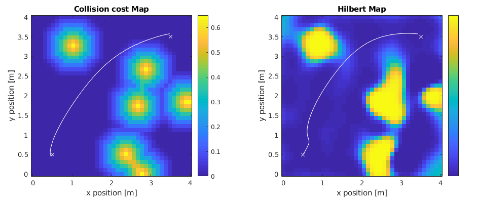

# unknown_mavplanning_matlab

This repository includes matlab tools to experiment on navigating through unknown environments utilizing hilbertmaps.




# Dependency
The matlab code uses the following toolboxes
- Robotics Toolbox
- Deep Learning Toolbox

# Running the code
To initialize the workspace, run the following command
```
init_workspace
```
This way, all functions are available in the path.

For testing, run the `navigator` to do benchmarks of navigating through the environment 
```
navigator
```

# Contact
Jaeyoung Lim jalim@student.ethz.ch
